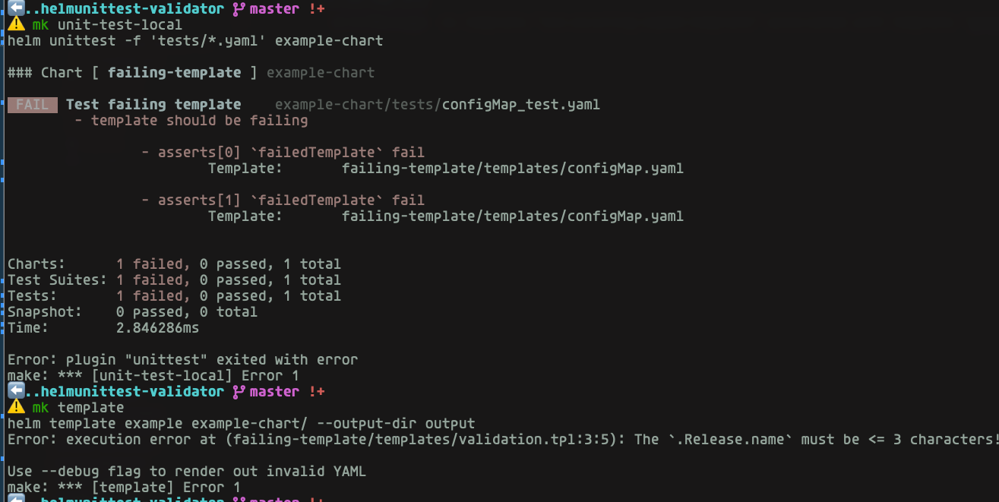

# Helm UnitTest Validator Issue

---

---

## Resources

- [Test is based of](https://github.com/helm-unittest/helm-unittest/blob/main/test/data/v3/failing-template/tests/configMap_test.yaml)
- [Current test can be found her](./example-chart/tests/)

Incorrect behavior

## Create

[**Create a repository using this template →**][template.generate]

<!-- resources -->
[template.generate]: https://github.com/ik-workshop/open-source-issue-blueprint/generate
